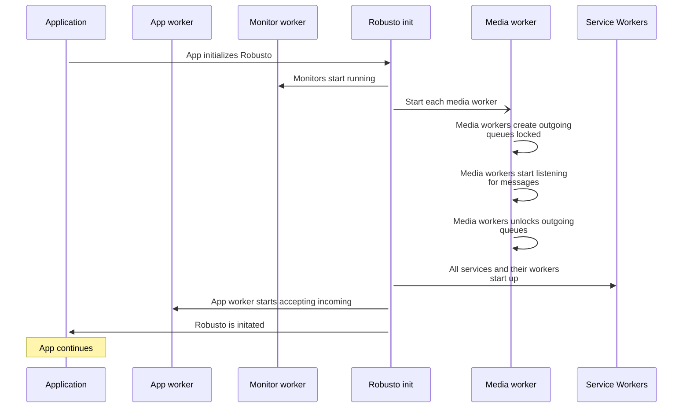

# DEVELOPMENT

This folder is meant to contains the templates and tools needed for development.  
*(In this case, it is taken from the Robusto template project at some time, so they might be out of date, you might want to either update or make your own rules)*

- [DEVELOPMENT](#development)
  - [Templates](#templates)
    - [template.h](#templateh)
    - [template.c](#templatec)
- [Diagrams](#diagrams)
- [KConfig-config](#kconfig-config)


## Templates

### template.h
These files should be use as templates for header files.
Note that header files for external use are put in a separate /include structure.

* A basic, doxygen doc section
    * File name, Author, version, creation date
    * A brief description<br/>(if you can't describe it briefly, maybe split it?)
    * Copyright, the 2-clause BSD license
* A `#pragma once` to ensure a [header is only included once](https://en.wikipedia.org/wiki/Pragma_once).
* Optional: C++ anti mangling <br />
If this header file is used by C++ code, you may need to have to stop the compiler from [mangling the function names](https://en.wikipedia.org/wiki/Name_mangling). 
### template.c

These files should be use as templates for source files. 

* A basic, doxygen doc section
    * File name, Author, version, creation date
    * A brief description<br/>(if you can't describe it briefly, maybe split it?)
    * Copyright, the 2-clause BSD license


# Diagrams

UML-style diagrams are a great way to explain your project. This is an example of a diagram-as-code using Mermaid (if you use VS Code a recommended extension would be `bierner.markdown-mermaid`).
Should be noted that PlantUML has more features and is more mature, but it is just so easy to include it directly in the markdown like below . 

Example diagram showing the Robusto messaging and is source:

<table>
<tr>
<td>



</td>
<td>

````


````
</td>

</tr>
</table>
As a twofer, in the raw source, you also get to learn how to escape a triple backtick. :-)

# KConfig-config
KConfig is a tool for keeping track of the configurations of a project. 
ESP-IDF uses it to great effect, so why not use it?

Like ESP-IDF, it uses kconfiglib (`pip install kconfiglib`), which installs all of the tools.
It is a bit less intelligent than ESP-IDF, as it doesn't automatically look through the project for Kconfig-files. 
Also, it could be smarter about a few stuff. 

Anyway, it adds, Kconfigs to both Native and Arduino in my project (ESP-IDF obviously already has it). It adds itself automatically, it might work with more frameworks.
As I don’t control the Arduino and Native platforms, It isn’t the most elegant as I need extra_scripts .
Neither it is the most intelligent, as it doesn’t look for Kconfigs everywhere like ESP-IDF. So far though, my configs all orsource each other, so it doesn’t matter. But for it to be general, that would have to be added.

It has the following scripts and templates, and they are in the platformio.ini:s [env] extra_scripts.<br/>
Hence it is called by all environments in this fashion:

- `scripts/init_env.py`<br/>
If the framework isn’t ESP-IDF, it adds a “Run Menuconfig” project task to the current environment.

- `scripts/run_menuconfig.py`<br/>
When the “Run Menuconfig” task is clicked, it passes the environment name, let’s say it is uno, for the Arduino environment to `scripts/run_menuconfig.py`.
First it copies `scripts/Kconfig.template` to `./Kconfig.uno`.
Then it runs:
`KCONFIG_CONFIG=.config.uno menuconfig ./Kconfig.uno`
…producing `.config.uno` when the user saves the settings.

- `pre:scripts/pre-build.py`<br/>
This is run on every build, there it:
  - runs<br/>
  `KCONFIG_CONFIG=.config.uno genconfig Kconfig.uno --header-path $BUILD_DIR/config/robconfig_.h`<br/>
…to create the header file in `$BUILD_DIR/config` and adds it to the CPPPATH and env.BuildSources.
  - copies the `scripts/robconfig.h` header file into `$BUILD_DIR/config`<br/>
  This file imports `sdkconfig.h` if it is ESP-IDF(`$PIOENV=espidf`) and the `robconfig_.h` it is not. This way, an application doesn't have to care what generates its configuration.
