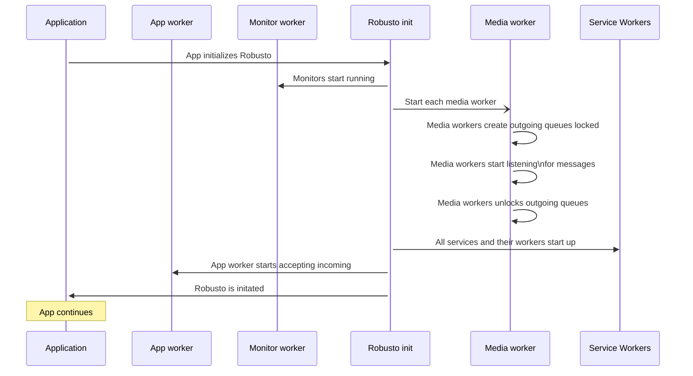

# DEVELOPMENT

This folder is meant to contains the templates and tools needed for Robusto development.  
*(In this case, it is taken from the Robusto template project at some time, so they might be out of date, you might want to either update or make your own rules)*

## Templates

### template.h
These files should be use as templates for header files.
Note that header files for external use are put in a separate /include structure.

* A basic, doxygen doc section
    * File name, Author, version, creation date
    * A brief description<br/>(if you can't describe it briefly, maybe split it?)
    * Copyright, the 2-clause BSD license
* A `#pragma once` to ensure a [header is only included once](https://en.wikipedia.org/wiki/Pragma_once).
* Optional: C++ anti mangling <br />
If this header file is used by C++ code, you may need to have to stop the compiler from [mangling the function names](https://en.wikipedia.org/wiki/Name_mangling). 
### template.c

These files should be use as templates for source files. 

* A basic, doxygen doc section
    * File name, Author, version, creation date
    * A brief description<br/>(if you can't describe it briefly, maybe split it?)
    * Copyright, the 2-clause BSD license


# Diagrams

UML-style diagrams are a great way to explain your project. This is an example of a diagram-as-code using Mermaid (if you use VS Code a recommended extension would be `bierner.markdown-mermaid`).
Should be noted that PlantUML has more features and is more mature, but it is just so easy to include it directly in the markdown like below . 

Example diagram showing the Robusto messaging and is source:

<table>
<tr>
<td>



</td>
<td>

```


</td>

</tr>
</table>